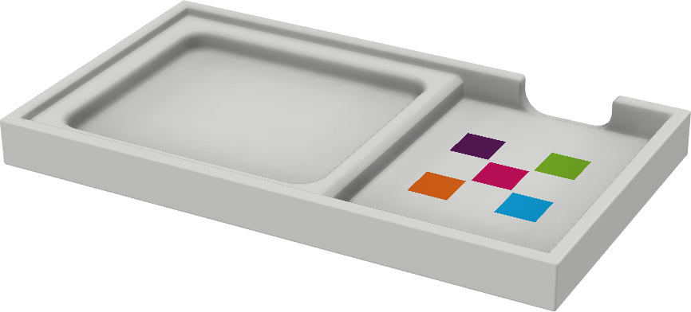
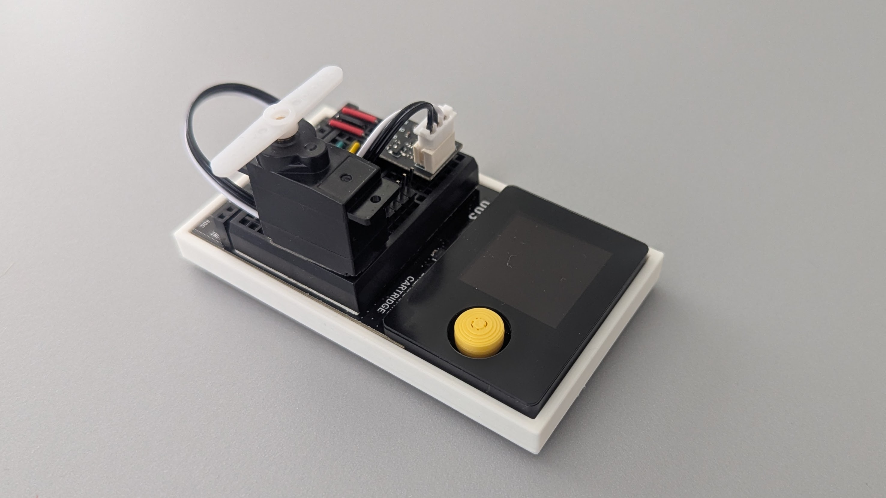
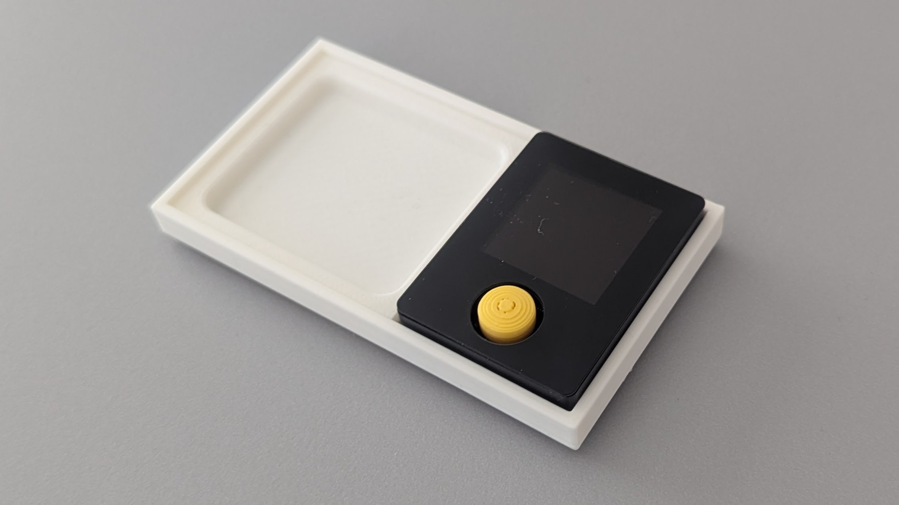

# Case for Oxocard Connect

This repository contains the design files for a case designed to hold an Oxocard Connect device.
The case is intended to be 3D printed and provides protection and accessibility for the device.
It also makes the breadboard flat and allows for easy access to the pins.

## Example of the case used with the Oxocard Connect and the breadboard.

## Example of the case used with the Oxocard Connect only.

The STL files for the case are available in the `stl` directory, and the Fusion 360 model can be downloaded from [here](https://a360.co/3IRAtbq).